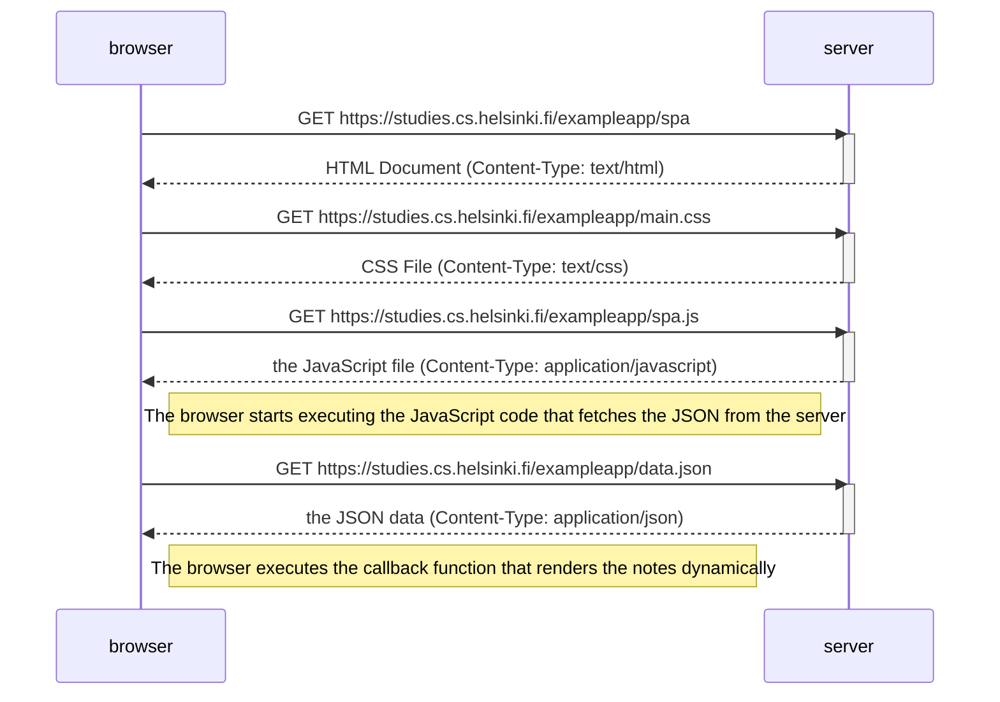

```mermaid 
sequenceDiagram
    participant browser
    participant server
    
    browser->>server: GET https://studies.cs.helsinki.fi/exampleapp/spa
    activate server
    server-->>browser: HTML Document (Content-Type: text/html)
    deactivate server
    
    browser->>server: GET https://studies.cs.helsinki.fi/exampleapp/main.css
    activate server
    server-->>browser: CSS File (Content-Type: text/css)
    deactivate server
    
    browser->>server: GET https://studies.cs.helsinki.fi/exampleapp/spa.js
    activate server
    server-->>browser: the JavaScript file (Content-Type: application/javascript)
    deactivate server
    
    Note right of browser: The browser starts executing the JavaScript code that fetches the JSON from the server 
    
    browser->>server: GET https://studies.cs.helsinki.fi/exampleapp/data.json
    activate server
    server-->>browser: the JSON data (Content-Type: application/json)
    deactivate server

    Note right of browser: The browser executes the callback function that renders the notes dynamically
```