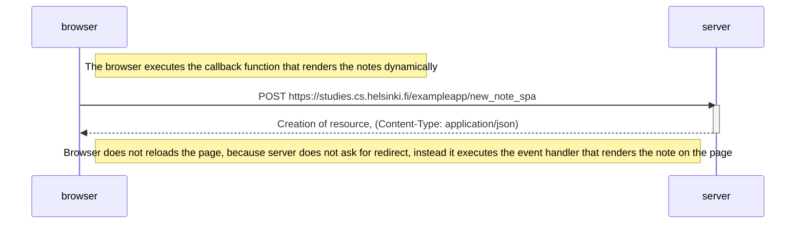

```mermaid 
sequenceDiagram
    participant browser
    participant server
    
    Note right of browser: The browser executes the callback function that renders the notes dynamically

    browser->>server: POST https://studies.cs.helsinki.fi/exampleapp/new_note_spa
    activate server
    server-->>browser: Creation of resource, (Content-Type: application/json)
    deactivate server

    Note right of browser: Browser does not reloads the page, because server does not ask for redirect, instead it executes the event handler that renders the note on the page
```