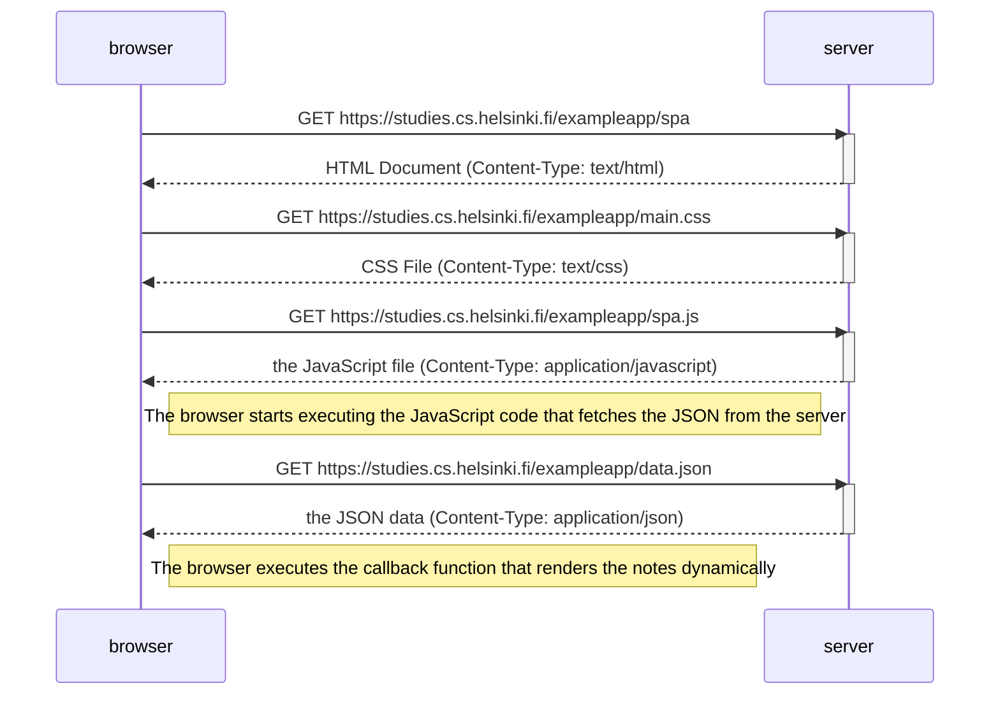
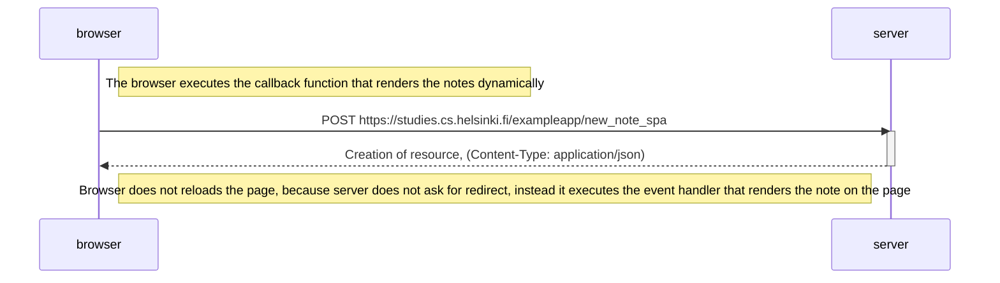

# [Fundamentals of Web apps - Chapter 0](https://fullstackopen.com/en/part0/fundamentals_of_web_apps)

## Exercise 0.4 - New note diagram
*Create a similar diagram depicting the situation where the user creates a new note on the page https://studies.cs.helsinki.fi/exampleapp/notes by writing something into the text field and clicking the submit button.*

### **Solution** 

## Exercise 0.5 - Single page app diagram
*Create a diagram depicting the situation where the user goes to the single-page app version of the notes app at https://studies.cs.helsinki.fi/exampleapp/spa.*

### **Solution** 

## Exercise 0.6 - New note in Single page app diagram
*Create a diagram depicting the situation where the user creates a new note using the single-page version of the app.*

### **Solution** 

